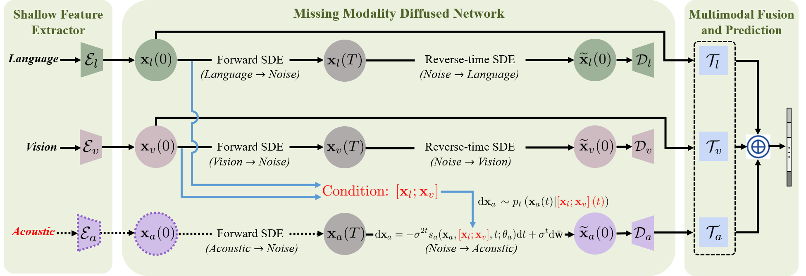

# [Incomplete Multimodality-Diffused Emotion Recognition, NeurIPS 2023.](https://openreview.net/pdf?id=BuGFwUS9B3)


We propose the Incomplete Multimodality-Diffused emotion recognition (IMDer) method that maps input random noise to the distribution space of missing modalities and recovers missing data in accordance with their original distributions. 

## The Framework of IMDer.



 (1) IMDer maps input random noise to the distribution space of missing modalities and recovers missing data in accordance with their original distributions.
(2) To minimize the semantic ambiguity between the missing and recovered modalities, IMDer utilize the available modalities as prior conditions to guide and refine the recovering process.
Please refer to our [paper](https://openreview.net/pdf?id=BuGFwUS9B3) for details.

## Usage

### Prerequisites
- Python 3.8
- PyTorch 1.9.0
- CUDA 11.4

### Datasets
Data files can be downloaded from [here](https://drive.google.com/drive/folders/1BBadVSptOe4h8TWchkhWZRLJw8YG_aEi), and you only need to download the aligned data. 
You can put the downloaded datasets into `dataset/` directory.

### Pretrained weights
Before running missing cases, you should [download](https://drive.google.com/drive/folders/1rYqT-lR-TF73pEkfT_csA-_YeHpEK84d?usp=drive_link) the weights pretrained by complete multimodal data (i.e., MR=0.0).
You can put the downloaded weights into `pt/` directory.

### Run the Codes
Running the following command:
```
python train.py
```

### Citation
If you find the code helpful in your research or work, please cite the following paper.
```
@inproceedings{wang2023incomplete,
  title={Incomplete Multimodality-Diffused Emotion Recognition},
  author={Wang, Yuanzhi and Li, Yong and Cui, Zhen},
  booktitle={Thirty-seventh Conference on Neural Information Processing Systems},
  year={2023}
}
```
